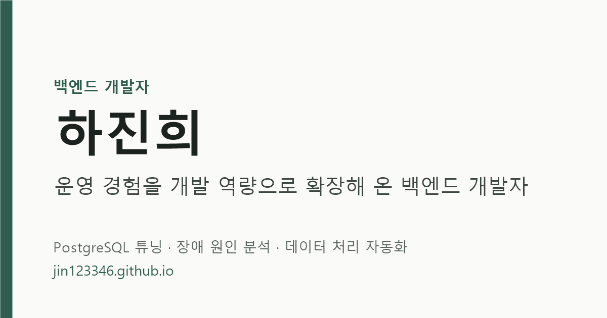

  

&nbsp;

&nbsp;

 

 

## 👋 About

**운영 경험을 개발 역량으로 확장해 온 백엔드 개발자, 하진희입니다.**

서버·인프라 운영 경험을 바탕으로 데이터베이스와 백엔드 개발 역량을 확장해 왔습니다.
현재 국립중앙과학관에서 자연사정보시스템(NARIS)을 운영하며 PostgreSQL 기반 데이터 관리, SQL 성능 분석, 시스템 장애 원인 분석, Python 기반 업무 자동화를 수행하고 있습니다.

 

## 📈 Highlights

| ⚡ **40.33s → 4.07s** | 📉 **−97.9%** | 🧬 **1,200+** |
| :---: | :---: | :---: |
| OpenAPI 실제 응답시간 PostgreSQL 실행계획 분석 · 운영 적용 · 약 90% 단축 | Shared Buffer 접근량 행 단위 함수 호출을 집합 처리로 전환 | BioFlow 실사용 입력 건수 1인 개발 데이터 입력 자동화 도구 |

- 🏆 **국제과학관심포지엄 우수상** — AI 생물 이미지 자동 동정 PoC, 제1저자 (국립중앙과학관, 2025)
- 🏆 **팀프로젝트 경진대회 최우수상** — Plantry, 롯데 측 현업 개발자 평가 (2024)

 

## 🗂 Projects

| | 프로젝트 | 한 줄 요약 |
| :---: | --- | --- |
| 🏛 실무 | [**OpenAPI 조회 성능 개선 (표본·관찰·종정보)**](https://jin123346.github.io/project.html?id=openapi-tuning) | 행 단위 함수 호출을 집합 처리로 전환 — 3종 운영 적용, API 응답 40.33s → 4.07s |
| 🏛 실무 | [**Error Page 적용 및 로그인 세션 장애 해결**](https://jin123346.github.io/project.html?id=ipt-auth) | Apache 리버스 프록시·Tomcat 오류 처리 구조 분석 |
| 🏛 실무 | [**BioFlow**](https://jin123346.github.io/project.html?id=bioflow) | 생물 관찰·표본 데이터 입력 자동화 데스크톱 앱 |
| 🏛 실무 | [**AI 생물 이미지 자동 동정 PoC**](https://jin123346.github.io/project.html?id=ai-species-id) | YOLOv8 객체 탐지 — mAP@0.5 96.4% |
| 🧪 개인 | [**Port Pulse**](https://jin123346.github.io/project.html?id=port-pulse) | 공공데이터 항만 입출항·관제 데이터 파이프라인 (진행 중) |
| 👥 팀 | [**Plantry**](https://jin123346.github.io/project.html?id=plantry) | 업무 협업 플랫폼 — SFTP 파일 서버·공유 드라이브 |
| 👥 팀 | [**ApplusMarket**](https://jin123346.github.io/project.html?id=applusmarket) | 전자제품 중고거래 앱 — Kafka 비동기 크롤링, 무중단 배포 |
| 👥 팀 | [**LotteOn 쇼핑몰**](https://jin123346.github.io/project.html?id=lotteon) | Spring Boot · Thymeleaf 이커머스 — 팀장, CI/CD |

 

## 🛠 Tech Stack

 

### 📄 이력서와 경력기술서를 확인해 주세요

이 사이트는 순수 HTML · CSS · JavaScript로 만들고 GitHub Pages로 배포했습니다. 콘텐츠는 JSON으로 분리되어 있고, 이력서는 인쇄용 CSS로 A4 PDF 출력을 지원합니다. · <a href="docs/GUIDE.md">관리 가이드</a>

